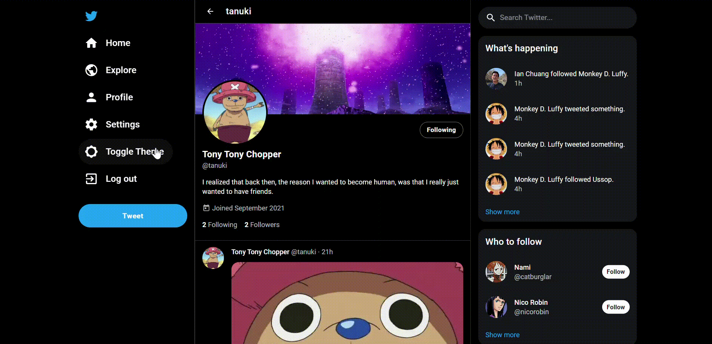

# Twitter-From-Scratch

Welcome to **Twitter-From-Scratch**, a ground-up implementation of the beloved social media platform, Twitter. Crafted with precision using modern technologies such as ReactJS, Redux, Firebase, and Material UI.

Explore the live demo: [Twitter-From-Scratch Demo](https://ian-chuang.github.io/Twitter/)

<p align="center">
  
</p>

## Overview

This project is a comprehensive reimagining of Twitter, offering an immersive user experience where you can effortlessly create an account, post tweets, and interact with other users' content.

## Key Features

- **Tweet Creation**: Express yourself by composing tweets.
- **Timeline**: Engage with a dynamic timeline showcasing tweets from users you follow.
- **Engagement**: Participate by replying, liking, and retweeting.
- **Connect**: Stay connected and informed by following other users.
- **Personalization**: Customize your profile with a picture, background, and bio.
- **Themes**: Adapt to your mood with light and dark themes.
- **Activity Feed**: Stay updated with users' actions through the activity feed.
- **User Profiles**: Explore user profiles by clicking avatars or usernames.
- **Intuitive UI**: Enjoy a well-designed interface that fits various screen sizes.

<p align="center">
  
</p>

## Usage Guide

- To create a tweet, click the blue tweet button in the side navigation or use the button at the top of the home page.
- Reply to tweets by clicking to expand and find the reply option.
- Like tweets by clicking the heart icon.
- View user profiles by clicking avatars or usernames.
- Follow users with the follow button in profiles or the follow menu.
- Toggle between light and dark themes with the Theme Toggle button in the navigation.
- Edit your profile by navigating to your profile page and clicking the edit button.

Discover these features and more to enhance your Twitter-From-Scratch experience!

<p align="center">
  
</p>

## Pages

Explore various app pages:

- **/login**: Log into your account.
- **/signup**: Create a new account.
- **/home**: Personalized timeline of tweets from followed users.
- **/explore**: Timeline featuring tweets from all users.
- **/profile/:username**: Your public profile visible to others.
- **/settings**: Manage your account settings.
- **/connect**: Discover users to follow.
- **/activity**: Stay informed about recent actions.
- **/tweet/:tweetid**: View replies to a specific tweet.

## Layout Design

The app's responsive layout elegantly adjusts content as you resize. The interface takes inspiration from Twitter's column-based structure:

- **Primary Column**: Central column for vital content like timelines and profiles.
- **Secondary Column**: Right column for supplementary information, e.g., suggested users and activity feeds.

<p align="center">
  
</p>

## More Visuals

Dive into the app's visuals:

<p align="center">
  
  
  
</p>

## Installation

To run the app locally:

1. Clone this repository.
2. Navigate to the project directory.
3. Run this command:

   ```sh
   yarn start
   ```
